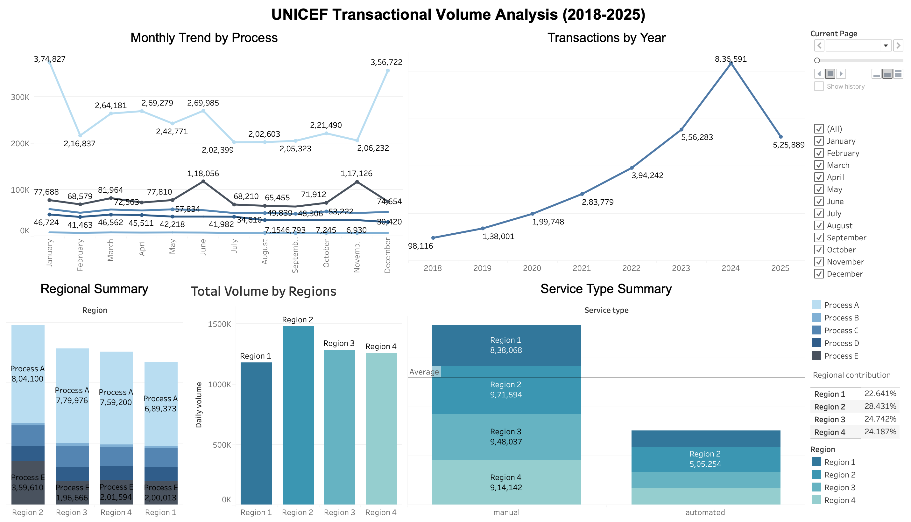

# UNICEF Transaction Volume Analysis

## Overview
This repository contains the data analysis and visualizations completed for the **Business Data & Analytics Management Internship** at the UNICEF Global Shared Services Centre (Strategic Business Modernization Section). 

The primary objective of this project is to analyze daily transaction volumes across five distinct operational processes to identify emerging trends, detect unusual anomalies, and provide a comparative analysis of service delivery across different regions and service types.

## Data Source
* **Dataset:** `Dataset.csv`
* **Dimensions:** Date (Daily), Process (A-E), Region (1-4), Service Type (Automated/Manual).
* **Metrics:** Daily transaction volume (number of cases).

## Key Analytical Objectives

### 1. Anomaly & Outlier Detection
* Analyzed the daily transaction distributions to identify statistically significant spikes or drops in case volumes. 
* Investigated isolated incidents to propose potential root causes, such as system outages, batch processing delays, or seasonal operational bottlenecks.

### 2. Time-Series Trend Analysis
* Aggregated daily data into monthly cohorts to evaluate the long-term trajectory of each process.
* Evaluated whether overall volumes are increasing, decreasing, or remaining stagnant over the observed period.
* Identified recurring cyclical patterns within specific processes.

### 3. Regional and Service Type Comparison
* Deployed summary statistics to evaluate the load distribution across Regions 1 through 4.
* Compared the efficiency and utilization of **Automated** versus **Manual** service types to highlight potential areas for process modernization and automation.

## Visualizations
The findings have been compiled into an interactive dashboard designed for a diverse stakeholder audience, ranging from analytical beginners to data experts. 

*(Note: If the image does not load, please check the `assets/` folder in this repository.)*

## Tools & Technologies
* **Data Processing & Analytics:** Python / Pandas / Excel *(Adjust based on your actual data prep tool)*
* **Data Visualization:** Tableau 
* **Reporting:** Microsoft PowerPoint

## Author
**Sujit Mudili** *MSc IT for Business Data Analytics* Budapest, Hungary
